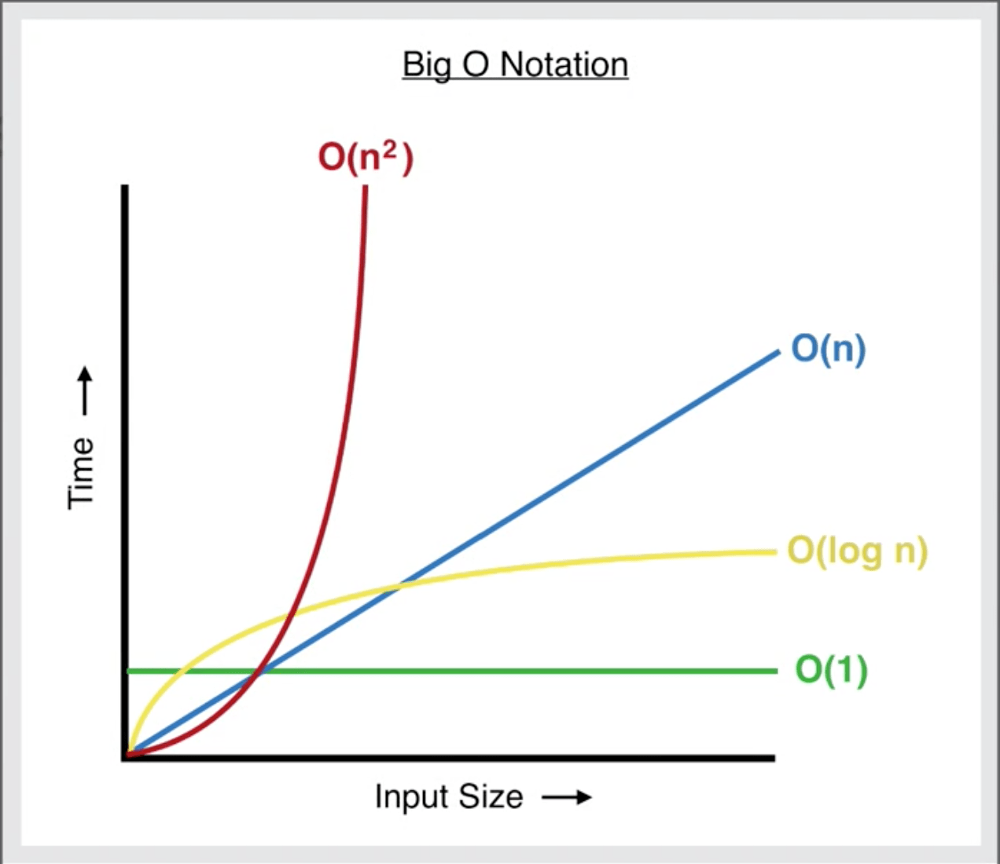

# Big-O notation

The Big-O notation measures the worst-case complexity of an algorithm. In Big-O notation,
`n` represent the number of input.

**References**

[Book javascript Data Structures and Algorithms An Introduction to Understanding and implementing Core Data Structure and Algorithms](https://www.google.ca/books/edition/JavaScript_Data_Structures_and_Algorithm/K_aEDwAAQBAJ?hl=en&gbpv=1&printsec=frontcoverfor)

## "What will happen as n approaches infinity ?"



## O(1) Constant time or O(n) linear time

```ts
function exampleLinear(n) {
  for (var i = 0; i < n; i++) {
    console.log(i);
  }
}
```

## O(n\*\*2) Quadratic time

```ts
function exampleLinear(n) {
  for (var i = 0; i < n; i++) {
    console.log(i);
    for (var j = 0; j < n; j++) {
      console.log(j);
    }
  }
}
```

```ts
function exampleLogarithmic(n) {
  for (var i = 2; i <= n; i = i ** 2) {
    console.log(i);
  }
}
```

## Rules of Big-O Notation

Let represent an algorithm's complexities as `f(n)`.

### Coefficient rule

If `f(n)` is `O(g(n))`, then `kf(n)` is `O(g(n))` for any constant k > 0.

The coefficient rule eliminates coefficients not related to input size, n.
This is because as `n` approach infinity, the other coefficient become negligible.

```ts
function getTotalCount(n) {
  let count = 0;
  for (let i = 0; i < a * n; i++) {
    count += 1;
  }
  return count;
}
```

This case the value of `a` is a constant. The fonction `getTotalCount()` could use `a` as `1` or `100`. The two function `f(n)` and `f(5n)` both have a big old notation off `O(n)`. This Is because if n get closer to infinity coefficient become negligible.

### Sum rule

If `f(n)` is `O(h(n))` and `g(n)` is `O(p(n))`, then `f(n)+g(n)` is `O(h(n) + p(n))`.

The sum rule must be applied before the coefficient rule.

```ts
function getTotalCount(n) {
  let count = 0;
  for (let i = 0; i < n; i++) {
    count += 1;
  }

  for (let i = 0; i < 5 * n; i++) {
    count += 1;
  }
  return count;
}
```

This example the first loop `f(n) = n` the second loop `f(n) = 5n` resulting in `f(n) = 6n`,
when applying the coefficient rule the final result is `O(n) = n`.

### Product rule

If `f(n)` is `O(h(n))` and `g(n)` is `O(p(n))`, then `f(n)g(n)` is `O(h(n)p(n))`.

```ts
function getTotalCount(n) {
  let count = 0;
  for (let i = 0; i < n; i++) {
    count += 1;
    for (let i = 0; i < 5 * n; i++) {
      count += 1;
    }
  }

  return count;
}
```

This example, `f(n) = 5n^n` this result in a total of `5n^2` operations.
Apply the coefficient rule. The result is `O(n) = n^2`.

### Transitive rule

If `f(n)` is `O(g(n))` and `g(n)` is `O(h(n))`, then `f(n)` is `O(h(n))`.

The transitive rule is a simple way to state that the same time complexity has the same Big-O.

### Polynomial rule

If `f(n)` is polynomial of degree `k`, then `f(n)` is `O(n^k)`.

```ts
function getTotalCount(n) {
  let count = 0;
  for (let i = 0; i < n*n; i++) {
    count += 1;
  }

  return count;
}
```

In this example, `f(n) = n^2`.

### Log of a power rule

If `log(nk)` is `O(log(n))` for any constant K > 0.

[Data Structure github repo](https://github.com/trekhleb/javascript-algorithms#data-structures)