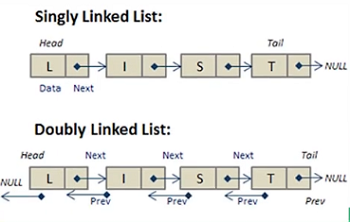

# Data structures

In computer science a data structure is a data organization and storage format that enables efficient access and modification.

Developer are interested in time and space complexity associated with the fourth fundamental operations: `Access`, `Insertion`, `Deletion` And `search`.

A data structure is a way of organizing and storing data in a computer computer so that it can be access and use efficiently. It's the defined relationship between the data and the operation that can be performed on the data.

**Reference**

- [Data Structure](https://www.geeksforgeeks.org/data-structures/)

## Why data a structure

- **Efficient data management**: They enable efficient storage and retrieval of data, Reducing processing time and improving performance.

- **Data organization**: They organize data and all logical matter, making it easier to understand and access.

- **Data obstruction**: They can hide the implementation detail of the data storage.

- **Reusability**: Common data structure can be used in multiple application, saving time and effort and development.

- **Algorithm optimization**: The choice of the appropriate date structure can Significantly impact the efficiency of algorithm that operate on the data.

## Classification of the structure

- **Linear data structures**: Store data in a sequential order is allowing for easy insertion and deletion operation. Example: Array, linked list, stack And queues.


- **Non-linear data structure**: These structures store data in a hierarchical, or interconnected manner, this allowing for more complex relationships between data elements. Example: Trees, Graphs and hash tables.

### Example of data structures

- Array
- Linked List
- Queue
- Stack

- Maps (Dictionary)
- Hash maps

- Binary Tree
- Binary Search
- Tree
- Heap
- Hashing
- Graph
- Matrix
- Misc
- Advanced Data Structure

## Linear Data structures

Store data in a sequential order is allowing for easy insertion and deletion operation. Example: Array, linked list, stack And queues.

### Advantage of linear data structures

- **Efficient data access**:

- **Dynamic sizing**:
- **Ease of implementation**:
- **Versatility**:
- **Simple algorithms**:


### Array

Array is a collection of element stored in a continuous memory locations. Array data structure can be fixed length or dynamic length. Array use zero base index.

Random access: Array provide constant time `O(1)`, access to elements.

```ts
const newArray = ["a", "b", "c", "d"];
newArray.push("Seb");
```


### Multidimensional Array

It is possible to create a two-dimensional array, also refer as a matrix or a array of array.

### Linked list

A link list is a linear data structure which look like a chain of node where each note contains a data feel in a reference link to the next note in the list unlike array Link list element are not stored in a continuous location in memory.

- **Node**: Each element in a link list is represented by a node, Which contain two component:

- **Data**: The actual data or value associate with the element.
- **Next Pointer (Link)**: Reference to the next node.

The first known is called the **head**. It serve as the starting point for travelling the list.

Last node is called the **tail**. The value of the link is NULL.

#### Operations

- **Accessing Elements**: Accessing a specific element in a linked list take O(n) time.

- **Searching**: Searching of a node in linked list O(n) time as whole list needs to traversed in worst case.

- **Insertion**: Insertion takes O(1) time if we at the position where we have to insert an element.

- **Deletion**: Delete takes O(1) time if we know the position of the element to e deleted.



#### Singly Linked Lists

The singly Linked list as every node store the address of the next node in the list, the last node has thr reference as NULL.

[Single linked list](https://medium.com/swlh/singly-linked-list-in-javascript-a0e58d045561)

#### Doubly Linked Lists

Doubly linked list each node has two pointers, one pointer to the next note and one pointer to the previous node. This be directional structure I allow for efficient traversal in both direction.

#### Circular Linked Lists

A circular Linked list is the type of Linked list in which the first and the last note are also connected to each other to form a circle. There is not NULL link.

### Stack

A stack is a linear data structure that follow the last-In-First-Out(LIFO) principle, meaning that the last element added to the stack is the first one to be removed.


#### Stack Operations

- **push()**: Element is added on top of the stack.
- **pop()**: An element is removed from the top of the stack.
- **top()**: This operation returned the last inserted element that is on top of the stack without removing it.
- **size()**: This operation returned the total number of element present in the stack.
- **isEmpty()**: This operation indicate whether the stack is empty or not.

- **Fixed size Stack**: As the name suggests, a fixed size has a fixed size and cannot grow shrink dynamically. If the stack is full, and an attempt is made to add element to it, an overflow error occurs. If the stack is empty and an attempt is made to remove an element from it an underflow error a cure.

- **Dynamic size Stack**: A dynamic size that can grow or shrink dynamically. This type of stack is implemented use a link list as it allows for easy resizing of the stack.

### Queue

A queue is a linear data structure that follows the First-In-First-Out (FIFO) principle. In a queue the first added, is the first one to be removed.

## Non-linear data structures

These structures store data in a hierarchical, or interconnected manner, this allowing for more complex relationships between data elements. Example: Trees, Graphs and hash tables.

## Data structures in Javascript/Typescript

- Set
- Weak Set
